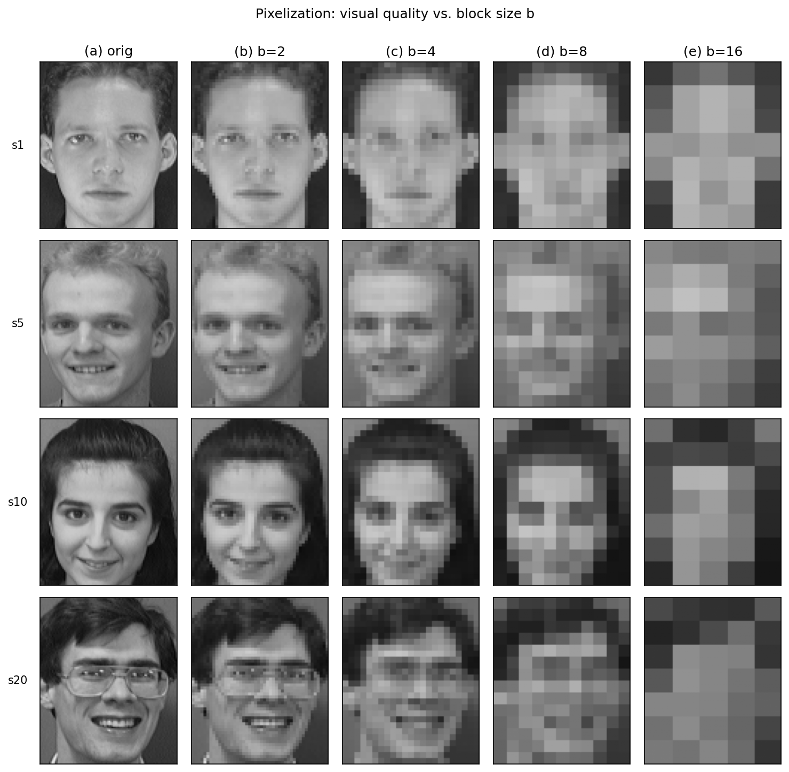
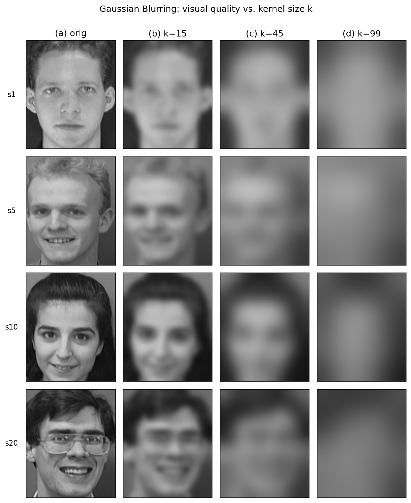
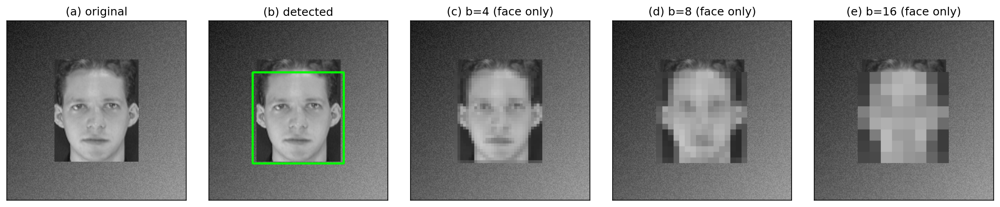

# Face De-identification HW3 — 人臉去識別化方法與 AI 重識別攻擊

> 重現並延伸 Fan (2018, *Image Pixelization with Differential Privacy*) 的研究：在 AT&T (ORL) 人臉資料庫上實作兩種傳統去識別化方法、用 CNN 量測它們抵抗重識別攻擊的能力，再以 ε-差分隱私強化並比較效用與隱私的取捨。

---

## 總覽

「人眼看不出」不等於「機器認不出」。傳統的 **Pixelization**（以 `b×b` 區塊取平均）與 **Gaussian Blurring**（以 `k×k` 高斯核卷積）能讓人臉在肉眼下難以辨識，但卷積神經網路常常能從殘留的低頻結構中還原身分。本專案分三步驗證這件事：

- **Step 1 — 去識別化**：對 ORL 人臉套用 Pixelization（`b = 2, 4, 8, 16`）與 Gaussian Blurring（`k = 15, 45, 99`），輸出各參數的去識別化資料集與視覺比較圖。
- **Step 2 — AI 重識別攻擊**：對「每一種去識別化參數」獨立訓練一個 CNN（不混訓，依論文做法），量測 Top-1 / Top-5 重識別準確率；隨機猜測的 Top-1 ≈ 1/40 = 2.5%。
- **Step 3 — 差分隱私**：實作 **DP-Pixelization** 與 **DP-Blur**，掃描 `ε ∈ {0.1, 0.3, 0.5, 0.7, 1, 3, 5}`，以 **MSE / SSIM** 衡量影像效用、並重跑 CNN 攻擊驗證差分隱私確實壓低了重識別準確率。

所有去識別化變體共用同一份 train/test 切分（`seed = 42`），攻擊準確率才能彼此對照。

---

## 示例圖

| Pixelization（`b = 2 → 16`） | Gaussian Blurring（`k = 15 → 99`） |
|:---:|:---:|
|  |  |

含背景影像的「先偵測人臉 → 只去識別化 bbox 區域」示意：



> `data/att_faces/` 為**真實的 AT&T (ORL) 人臉資料庫**（400 張 92×112 灰階 PGM，40 人各 10 張；來源見 [`data/README.md`](data/README.md)）。`scripts/make_synthetic_orl.py` 僅作為沒有網路 / 無法下載時的 fallback。

---

## 開發規劃

| Step | 內容 | 狀態 |
|---|---|---|
| Step 1 | Pixelization（b=2,4,8,16）、人臉偵測、資料載入 | ✅ 完成 |
| Step 1 | Gaussian Blurring（k=15,45,99） | ✅ 完成 |
| Step 1 | 視覺比較圖 | ✅ 完成 |
| Step 2 | CNN 架構 + 訓練 pipeline（每組參數獨立訓練） | ✅ 完成 |
| Step 2 | Top-1/Top-5 評估 + 8 組攻擊實驗 + 對照表 | ✅ 完成 |
| Step 3 | DP-Pixelization / DP-Blur + 敏感度推導 | ⬜ 待成員 5 |
| Step 3 | MSE/SSIM vs ε 曲線、DP-vs-NP 攻擊準確率對照 | ⬜ 待成員 5（+ 成員 4） |
| 文件 | 最終報告（方法 + 結果 + 討論 + 分工表） | 🟡 規劃中（由成員 2 統整、排版） |

詳細分工見 [`docs/division-of-labor.md`](docs/division-of-labor.md)。

---

## 給組員（必讀）

整個 repo 都在這裡、沒有任何保留 —— 程式碼、資料、產出全部同步。要快速接手 Step 2 / Step 3，只要看這幾個地方：

| 你是 | 直接拿 | 一定要看 |
|---|---|---|
| **成員 3、4（CNN 攻擊）** | `outputs/pixelized/pix_b{2,4,8,16}/`、`outputs/blurred/blur_k{15,45,99}/`（已從真實 ORL 產好；結構同 ORL、檔名一一對應）、`outputs/split_train.json` / `outputs/split_test.json`（標準切分） | `docs/division-of-labor.md` 的「交付對接備註」、`src/facedeid/dataset_loader.py`（用 `DatasetIndex.from_att(...)` + `stratified_split(..., seed=42)`，**8 組各自獨立訓練、不可混訓**） |
| **成員 5（差分隱私）** | `outputs/pixelized/` 與 `outputs/blurred/` 當 **NP baseline**；`data/att_faces/`（原圖，算 MSE/SSIM 用） | `src/facedeid/pixelize.py`、`src/facedeid/gaussian_blur.py`（DP 版在「未加噪的 cell 平均 / blur 後像素」上加 Laplace 噪聲；敏感度推導見 `docs/division-of-labor.md`） |
| 想了解全貌 | — | 本 README 的「總覽」「專案架構」、`docs/division-of-labor.md` |

> 跑法：`uv sync` 之後 `./scripts/run_pixelize.sh` / `./scripts/run_blur.sh` 可重建 `outputs/`；`uv run pytest` 跑煙霧測試。新增的去識別化變體一律沿用 `seed=42` 的切分。

---

## 系統需求

| 項目 | 需求 |
|---|---|
| Python | 3.13（見 `.python-version`；最低相容 3.10） |
| 套件管理 | [uv](https://docs.astral.sh/uv/) |
| 核心依賴 | `opencv-python`、`numpy`、`matplotlib`（見 `pyproject.toml`） |
| 可選 | `dlib`（HOG+SVM 人臉偵測，編譯需 cmake）、`torch` / `torchvision`（Step 2 CNN） |
| 作業系統 | macOS / Linux（`scripts/*.sh` 為 bash 腳本） |

---

## 開發環境建置

```bash
# 1. 安裝 uv（若尚未安裝）
curl -LsSf https://astral.sh/uv/install.sh | sh

# 2. 建立環境並安裝依賴（uv 會依 .python-version 取得 Python 3.13）
uv sync

# 含可選依賴：
uv sync --extra detect-hog          # 加 dlib HOG+SVM 人臉偵測
uv sync --extra attack              # 加 torch / torchvision（Step 2）
uv sync --group dev                 # 加 ruff / pytest 等開發工具

# 3. 驗證
uv run python -c "import facedeid; print('facedeid OK')"
uv run pytest                       # 去識別化函式的煙霧測試
uv run ruff check src scripts tests # 風格檢查
```

### 跑去識別化 pipeline

```bash
# 0. 準備資料集：把真實 ORL 放到 data/att_faces/s1 ... s40（見 data/README.md）
#    或先用合成資料驗證 pipeline：
uv run python scripts/make_synthetic_orl.py

# 1. 產生去識別化資料集（輸出到 outputs/，已被 .gitignore）
./scripts/run_pixelize.sh           # → outputs/pixelized/pix_b{2,4,8,16}
./scripts/run_blur.sh               # → outputs/blurred/blur_k{15,45,99}

# 2. 產生視覺比較圖（輸出到 figures/）
uv run python scripts/make_pixelize_comparison.py
uv run python scripts/make_blur_comparison.py
uv run python scripts/make_detect_pixelize_demo.py

# 也可以直接呼叫模組 CLI：
uv run python -m facedeid.gaussian_blur --input data/att_faces --output outputs/blurred/blur_k45 --k 45
uv run python -m facedeid.pixelize     --input data/att_faces --output outputs/pixelized/pix_b8  --b 8
```

### 跑 CNN 重識別攻擊 pipeline

```bash
# 先安裝 Step 2 需要的 torch / torchvision
uv sync --extra attack

# 單獨訓練一組資料；auto 會優先使用 CUDA，其次 Apple MPS，最後 CPU
uv run --extra attack python scripts/train.py --dataset-root outputs/pixelized/pix_b8 --name pix_b8 --config config.yaml --device auto

# 一次分別訓練 original + pix_b{2,4,8,16} + blur_k{15,45,99}
uv run --extra attack python scripts/train_all.py --config config.yaml --device auto

# Apple Silicon / M4 Pro 可明確指定 Metal GPU
uv run --extra attack python scripts/train_all.py --config config.yaml --device mps

# NVIDIA CUDA 可明確指定 CUDA GPU
uv run --extra attack python scripts/train_all.py --config config.yaml --device cuda

# 產生 loss / accuracy 曲線與 Top-1 / Top-5 summary
uv run --extra attack python scripts/plot_log.py --log-dir logs
uv run --extra attack python scripts/summarize_logs.py --log-dir logs --output reports/summary.csv

# 評估 8 組 checkpoint 的 Top-1 / Top-5 attack accuracy
uv run --extra attack python scripts/evaluate.py --all --device auto --output reports/evaluation.csv
```

### 在程式碼中使用

```python
from facedeid import DatasetIndex, stratified_split, load_image
from facedeid import pixelize, gaussian_blur, FaceDetector

idx = DatasetIndex.from_att("data/att_faces")
train, test = stratified_split(idx, test_ratio=0.2, seed=42)   # 全專案統一 seed=42

img = load_image(train.items[0][0])      # numpy uint8（預設灰階）
p_out = pixelize(img, b=8)               # Pixelization
g_out = gaussian_blur(img, k=45)         # Gaussian Blurring（sigma=0 → 由 k 自動推算）

# 含背景影像：偵測人臉 + 只處理 bbox 區域
det = FaceDetector(backend="haar")       # 或 backend="hog"（需 dlib）
g_out, boxes = facedeid.gaussian_blur_faces(img, k=45, detector=det, fallback_full=True)
```

---

## 專案架構

```
face-deid-hw3/
├── README.md
├── pyproject.toml                  # uv 專案定義與依賴
├── .python-version                 # 3.13
├── .gitignore
├── data/
│   ├── README.md                   # ORL / FaceScrub / CelebA 下載與目錄結構說明
│   └── att_faces/                  # AT&T (ORL)：s1/1.pgm ... s40/10.pgm（真實資料）+ ORL_README.txt
├── src/
│   └── facedeid/                   # 主套件
│       ├── __init__.py             # 對外 re-export
│       ├── dataset_loader.py       # 統一資料載入 / stratified train-test split（seed=42）
│       ├── face_detector.py        # 人臉偵測（Haar Cascade / dlib HOG+SVM）
│       ├── pixelize.py             # Pixelization（b×b 區塊取平均；含 CLI）
│       └── gaussian_blur.py        # Gaussian Blurring（k×k 高斯核卷積；含 CLI）
├── scripts/
│   ├── run_pixelize.sh             # 批次 b=2,4,8,16
│   ├── run_blur.sh                 # 批次 k=15,45,99
│   ├── make_pixelize_comparison.py # Pixelization 視覺比較圖
│   ├── make_blur_comparison.py     # Gaussian Blur 視覺比較圖
│   ├── make_detect_pixelize_demo.py# 偵測 + 區域去識別化示意圖
│   ├── make_synthetic_orl.py       # 沒有真實 ORL 時的 fallback 測試資料
│   └── evaluate.py                 # Step 2 Top-1 / Top-5 評估
├── tests/
│   └── test_smoke.py               # 去識別化函式的最小煙霧測試（uv run pytest）
├── figures/                        # 報告用視覺比較圖
├── outputs/                        # Step 1 產出：去識別化資料集 + 標準 train/test 切分
│   ├── pixelized/pix_b{2,4,8,16}/  #   Pixelization 各 b（PNG，結構同 ORL）
│   ├── blurred/blur_k{15,45,99}/   #   Gaussian Blur 各 k
│   ├── split_train.json            #   標準切分（320 張，seed=42）
│   └── split_test.json             #   標準切分（80 張）
└── docs/
    └── division-of-labor.md        # 五人分工與交付清單
```

> `outputs/` 已 commit 進 repo（確保組員拿到的內容完全一致），但它可由 `./scripts/run_*.sh` 從 `data/att_faces/` 重建。

> Step 2 的 CNN 訓練與評估 pipeline 已加入 `src/facedeid/model.py`、`scripts/train.py`、`scripts/train_all.py`、`scripts/plot_log.py`、`scripts/summarize_logs.py`、`scripts/evaluate.py` 與 `config.yaml`；Step 3（`dp_pixelize.py` / `dp_blur.py` / `compute_metrics.py`）待對應成員交付後加入。

---

## 貢獻

本專案為五人分組作業，分工如下（完整交付清單見 [`docs/division-of-labor.md`](docs/division-of-labor.md)）：

1. **成員 1** — 資料集前置、人臉偵測、Pixelization（b=2,4,8,16）：`dataset_loader.py`、`face_detector.py`、`pixelize.py`、`run_pixelize.sh`、視覺比較圖、資料集說明。
2. **成員 2** — Gaussian Blurring（k=15,45,99）、報告整合、最終打包：`gaussian_blur.py`、`run_blur.sh`、視覺比較圖、最終報告（規劃/排版）、本 repo 整理。
3. **成員 3** — CNN 架構與訓練 pipeline（每組去識別化參數獨立訓練）：`model.py`、`train.py`、`config.yaml`、訓練 log、各參數 `.pth`。
4. **成員 4** — CNN 評估與攻擊實驗：`evaluate.py`（Top-1/Top-5）、8 組攻擊結果對照表、攻擊分析。
5. **成員 5** — 差分隱私：`dp_pixelize.py`、`dp_blur.py`、`compute_metrics.py`、ε 掃描、MSE/SSIM 曲線、DP-vs-NP 對照表、敏感度推導文件。

提交前請確認：

1. `uv run ruff check src scripts` 無錯誤（已安裝 dev group 時）。
2. 新增模組在 `src/facedeid/__init__.py` 有對應 re-export（如適用）。
3. 任何新的去識別化變體都沿用 `seed=42` 的 train/test 切分。
4. 不要把 `outputs/`、`.venv/`、`*.pth` 等生成物 commit 進 repo。

---

## 授權與致謝

本專案為課程作業，僅供教學與研究使用。

- AT&T (ORL) Database of Faces — AT&T Laboratories Cambridge，<https://cam-orl.co.uk/facedatabase.html>
- L. Fan, *Image Pixelization with Differential Privacy*, DBSec 2018（亦見 TPDP 2019）
- C. Dwork and A. Roth, *The Algorithmic Foundations of Differential Privacy*, 2014
