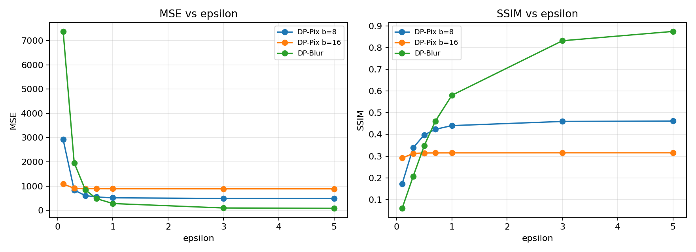
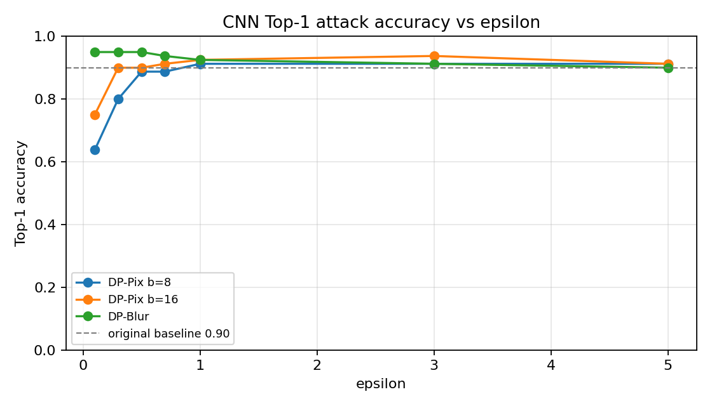

# Step 3 DP CNN Attack Results

本頁整理成員 5 提供的 DP 影像資料集在 CNN 重識別攻擊下的結果。資料集以外部 artifact `for_cnn.zip` 交付，並已確認其中的 original 影像與本 repo 的 AT&T (ORL) 資料一致。

每一個 method × epsilon 都獨立訓練一個 CNN，沒有混合訓練。評估使用相同的 `outputs/split_train.json` 與 `outputs/split_test.json`。

執行指令：

```bash
uv run --extra attack python scripts/train_evaluate_dp.py --device auto --output reports/dp_evaluation.csv
```

## Curves





## DP-Pixelization b=8

| Epsilon | Top-1 Accuracy | Top-5 Accuracy | Test Loss | MSE | SSIM |
|---:|---:|---:|---:|---:|---:|
| 0.1 | 0.6375 | 0.9000 | 1.3361 | 2921.1873 | 0.1726 |
| 0.3 | 0.8000 | 0.9750 | 0.7415 | 832.8361 | 0.3390 |
| 0.5 | 0.8875 | 1.0000 | 0.4185 | 610.3617 | 0.3979 |
| 0.7 | 0.8875 | 0.9875 | 0.4040 | 549.4801 | 0.4235 |
| 1.0 | 0.9125 | 0.9750 | 0.4704 | 516.3490 | 0.4405 |
| 3.0 | 0.9125 | 1.0000 | 0.4200 | 488.2429 | 0.4598 |
| 5.0 | 0.9125 | 0.9875 | 0.3021 | 486.0260 | 0.4616 |

## DP-Pixelization b=16

| Epsilon | Top-1 Accuracy | Top-5 Accuracy | Test Loss | MSE | SSIM |
|---:|---:|---:|---:|---:|---:|
| 0.1 | 0.7500 | 0.9750 | 0.9148 | 1088.1939 | 0.2912 |
| 0.3 | 0.9000 | 0.9875 | 0.5456 | 908.1247 | 0.3122 |
| 0.5 | 0.9000 | 0.9875 | 0.3868 | 893.7371 | 0.3145 |
| 0.7 | 0.9125 | 0.9875 | 0.4750 | 890.1329 | 0.3151 |
| 1.0 | 0.9250 | 0.9875 | 0.4091 | 888.0206 | 0.3153 |
| 3.0 | 0.9375 | 1.0000 | 0.4050 | 886.2595 | 0.3156 |
| 5.0 | 0.9125 | 0.9875 | 0.6166 | 886.1223 | 0.3157 |

## DP-Blur

| Epsilon | Top-1 Accuracy | Top-5 Accuracy | Test Loss | MSE | SSIM |
|---:|---:|---:|---:|---:|---:|
| 0.1 | 0.9500 | 0.9875 | 0.3924 | 7381.4633 | 0.0597 |
| 0.3 | 0.9500 | 0.9875 | 0.4081 | 1959.2503 | 0.2075 |
| 0.5 | 0.9500 | 1.0000 | 0.2527 | 849.8495 | 0.3484 |
| 0.7 | 0.9375 | 0.9750 | 0.3173 | 485.1291 | 0.4609 |
| 1.0 | 0.9250 | 1.0000 | 0.3774 | 279.6416 | 0.5802 |
| 3.0 | 0.9125 | 1.0000 | 0.3376 | 96.9934 | 0.8313 |
| 5.0 | 0.9000 | 0.9750 | 0.3852 | 82.1760 | 0.8742 |

## Comparison With Baseline

| Method | Non-DP Reference Top-1 | Lowest DP Top-1 | Epsilon at Lowest DP Top-1 |
|---|---:|---:|---:|
| Pixelization b=8 | 0.9125 | 0.6375 | 0.1 |
| Pixelization b=16 | 0.9000 | 0.7500 | 0.1 |
| DP-Blur | 0.9000 original reference | 0.9000 | 5.0 |

## Analysis

DP-Pixelization 在低 epsilon 時能降低 CNN attack accuracy。`DP-Pix-b8` 在 epsilon = 0.1 時 Top-1 accuracy 為 0.6375，相比非 DP `pix_b8` 的 0.9125 明顯下降；`DP-Pix-b16` 在 epsilon = 0.1 時 Top-1 accuracy 為 0.7500，也低於非 DP `pix_b16` 的 0.9000。

epsilon 變大時，MSE 下降、SSIM 上升，影像更接近原圖，CNN attack accuracy 也大致回升。這符合 DP 隱私強度與影像可用性之間的 trade-off。

DP-Blur 的結果較不理想，Top-1 accuracy 仍維持在 0.9000 到 0.9500 之間，表示這版 DP-Blur 雖然在低 epsilon 時造成很大的 MSE 與很低的 SSIM，但仍保留足夠的身份線索讓 CNN 辨識。報告中可將此解釋為：本次 DP-Blur 機制對影像品質破壞明顯，但不一定有效降低重識別攻擊。
